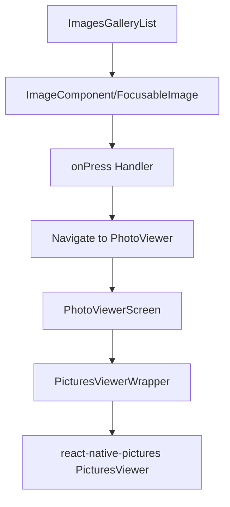

# React Native Pictures Integration Plan

## Overview
This document outlines the integration plan for adding the `react-native-pictures` library to enable full-screen photo viewing with swipe navigation in the existing photo gallery app.

## Current App Architecture

### Key Components
- **Main Gallery**: [`ImagesGalleryList`](src/components/ImagesGalleryList.tsx) renders photos in a grid using FlashList
- **Image Components**: Modular system with [`ImageComponent`](src/components/image/ImageComponent.tsx), [`ExpoImageComponent`](src/components/image/ExpoImageComponent.tsx), and [`FocusableImage`](src/components/image/FocusableImage.tsx) for TV
- **Data Flow**: [`MediaLibraryPhotosProvider`](src/providers/MediaLibraryPhotosProvider/useMediaLibraryPhotos.ts) → [`CachedPhotosProvider`](src/providers/CachedPhotosProvider/useCachedPhotos.ts) → Gallery components
- **Routing**: Uses Expo Router with [`Stack`](src/app/_layout.tsx) navigation

### Current Data Structure
```typescript
type CachedPhotoType = {
  originalPhotoUri: string;
  cachedPhotoUri: string;
  mipmapWidth: number;
}

type MediaLibraryPhoto = {
  uri: string;
}
```

## Integration Strategy

### User Experience Flow
1. User views photo gallery grid (current functionality)
2. User taps on any photo in the grid
3. App navigates to full-screen photo viewer
4. User can swipe left/right to navigate between photos
5. User can close viewer to return to gallery

### Architecture Diagram


## Implementation Steps

### ✅ Phase 1: Setup and Dependencies
- [ ] **Step 1.1**: Install react-native-pictures dependency
  ```bash
  bun add react-native-pictures
  ```
- [ ] **Step 1.2**: Update TypeScript types for new photo viewer functionality

### ✅ Phase 2: Core Photo Viewer Implementation
- [ ] **Step 2.1**: Create new photo viewer screen route
  - File: `src/app/photo-viewer/[index].tsx`
  - Receives photo index as route parameter
  - Loads all cached photos from context
  
- [ ] **Step 2.2**: Create PicturesViewer wrapper component
  - File: `src/components/PhotoViewer/PicturesViewerWrapper.tsx`
  - Transform `CachedPhotoType` to PicturesViewer format
  - Handle loading states and error scenarios
  - Provide consistent styling across platforms

### ✅ Phase 3: Navigation Integration
- [ ] **Step 3.1**: Add navigation logic to image components
  - Update [`ImageComponent`](src/components/image/ImageComponent.tsx) with `onPress` handler
  - Update [`FocusableImage`](src/components/image/FocusableImage.tsx) with `onPress` handler
  - Navigate to photo viewer with current photo index
  
- [ ] **Step 3.2**: Update routing configuration
  - Ensure new photo viewer route is properly configured
  - Handle navigation parameters correctly

### ✅ Phase 4: Photo Index Management
- [ ] **Step 4.1**: Implement photo index tracking
  - Create context or hook for managing current photo index
  - Enable navigation between photos within viewer
  - Sync with cached photos array

- [ ] **Step 4.2**: Handle photo data transformation
  - Convert cached photo URIs to format expected by PicturesViewer
  - Maintain photo metadata and quality

### ✅ Phase 5: Platform-Specific Considerations
- [ ] **Step 5.1**: Mobile platform optimization
  - Standard tap navigation with swipe gestures
  - Proper touch handling and gesture recognition
  
- [ ] **Step 5.2**: TV platform adaptation
  - Adapt focus navigation to work with photo viewer
  - Handle remote control navigation
  - Maintain existing TV focus behavior
  
- [ ] **Step 5.3**: Web platform compatibility
  - Ensure compatibility with web platform constraints
  - Handle mouse and keyboard navigation

### ✅ Phase 6: Error Handling and Polish
- [ ] **Step 6.1**: Add proper error handling
  - Handle failed image loads
  - Graceful fallbacks for missing photos
  - User feedback for errors
  
- [ ] **Step 6.2**: Add loading states
  - Loading indicators for photo viewer
  - Smooth transitions between photos
  - Performance optimization

### ✅ Phase 7: Testing and Validation
- [ ] **Step 7.1**: Test across platforms
  - Mobile (iOS/Android) functionality
  - TV platform compatibility
  - Web platform functionality
  
- [ ] **Step 7.2**: Performance testing
  - Memory usage with large photo sets
  - Smooth navigation between photos
  - Cache efficiency

## Technical Specifications

### New Files to Create
```
src/
├── app/
│   └── photo-viewer/
│       └── [index].tsx          # Photo viewer screen
├── components/
│   └── PhotoViewer/
│       ├── PicturesViewerWrapper.tsx  # Wrapper component
│       └── types.ts             # Photo viewer types
└── hooks/
    └── usePhotoNavigation.ts    # Photo navigation logic
```

### Key Dependencies
- `react-native-pictures`: Main photo viewer library
- `expo-router`: Navigation (already installed)
- `expo-image`: Image handling (already installed)

### Data Flow Enhancement
```typescript
// Enhanced photo data for viewer
type ViewerPhoto = {
  imageUrl: string;  // Required by react-native-pictures
  originalUri: string;
  cachedUri: string;
  index: number;
}
```

### Platform Compatibility Matrix
| Feature | Mobile | TV | Web |
|---------|--------|----|----|
| Tap to open | ✅ | ✅ | ✅ |
| Swipe navigation | ✅ | ❌* | ✅ |
| Focus navigation | ❌ | ✅ | ❌ |
| Keyboard navigation | ❌ | ✅ | ✅ |

*TV will use remote control buttons for navigation

## Benefits of This Approach
- ✅ Maintains existing gallery performance and caching
- ✅ Adds full-screen viewing with swipe navigation
- ✅ Preserves TV and web platform support
- ✅ Minimal disruption to current architecture
- ✅ Leverages existing photo data and providers
- ✅ Modular implementation allows for easy testing

## Risk Mitigation
- **Performance**: Leverage existing caching system to prevent memory issues
- **Platform Compatibility**: Test thoroughly on all supported platforms
- **User Experience**: Maintain familiar navigation patterns
- **Maintenance**: Keep integration modular for easy updates

## Success Criteria
- [ ] Users can tap any photo to open full-screen viewer
- [ ] Users can swipe between photos seamlessly
- [ ] All platforms (mobile, TV, web) work correctly
- [ ] Performance remains optimal with large photo sets
- [ ] Existing gallery functionality is preserved
- [ ] Error handling provides good user experience

## Next Steps
Once this plan is approved, proceed with Phase 1 implementation and work through each phase systematically, updating this document with progress and any modifications needed.