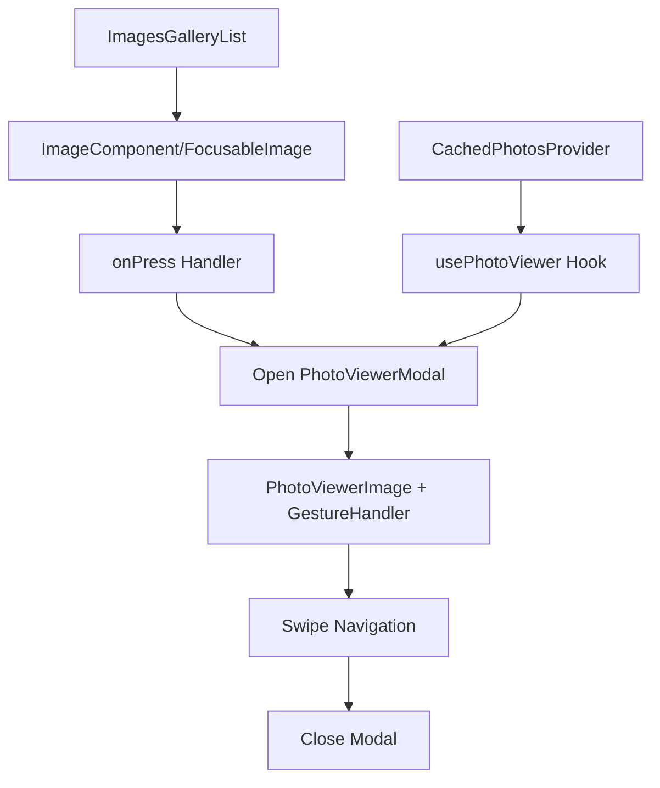

# React Native Native Photo Viewer Integration Plan

## Overview

This document outlines the integration plan for implementing a native Expo-based photo viewer to enable full-screen photo viewing with swipe navigation in the existing photo gallery app.

**Note**: Originally planned to use `react-native-pictures` and then `react-native-image-viewing`, but switched to a native Expo solution due to dependency conflicts and to maintain full Expo compatibility.

## Current App Architecture

### Key Components

- **Main Gallery**: [`ImagesGalleryList`](src/components/ImagesGalleryList.tsx) renders photos in a grid using FlashList
- **Image Components**: Modular system with [`ImageComponent`](src/components/image/ImageComponent.tsx), [`ExpoImageComponent`](src/components/image/ExpoImageComponent.tsx), and [`FocusableImage`](src/components/image/FocusableImage.tsx) for TV
- **Data Flow**: [`MediaLibraryPhotosProvider`](src/providers/MediaLibraryPhotosProvider/useMediaLibraryPhotos.ts) → [`CachedPhotosProvider`](src/providers/CachedPhotosProvider/useCachedPhotos.ts) → Gallery components
- **Routing**: Uses Expo Router with [`Stack`](src/app/_layout.tsx) navigation

### Current Data Structure

```typescript
type CachedPhotoType = {
  originalPhotoUri: string;
  cachedPhotoUri: string;
  mipmapWidth: number;
}

type MediaLibraryPhoto = {
  uri: string;
}
```

## Integration Strategy

### User Experience Flow

1. User views photo gallery grid (current functionality)
2. User taps on any photo in the grid
3. App opens full-screen photo viewer modal
4. User can swipe left/right to navigate between photos
5. User can close viewer to return to gallery

### Architecture Diagram



## Implementation Steps

### ✅ Phase 1: Setup and Dependencies

- [x] **Step 1.1**: Verify existing expo-image dependency (already installed v3.0.0)
- [x] **Step 1.2**: Update TypeScript types for native photo viewer functionality
- [x] **Step 1.3**: Create photo viewer types and interfaces

### ✅ Phase 2: Core Photo Viewer Implementation

- [x] **Step 2.1**: Create PhotoViewerModal component
  - File: `src/components/PhotoViewer/PhotoViewerModal.tsx`
  - Native modal using React Native Modal
  - Full-screen display with proper styling
- [x] **Step 2.2**: Create PhotoViewerImage component
  - File: `src/components/PhotoViewer/PhotoViewerImage.tsx`
  - Optimized expo-image for full-screen viewing
  - Pinch-to-zoom and pan gestures for mobile
- [x] **Step 2.3**: Implement gesture handling
  - File: `src/components/PhotoViewer/GestureHandler.tsx`
  - Horizontal swipe for navigation between photos
  - Platform-specific gesture handling

### ✅ Phase 3: State Management & Navigation Logic

- [x] **Step 3.1**: Create usePhotoViewer hook
  - File: `src/hooks/usePhotoViewer.ts`
  - Manage viewer state (visible, current index, photos array)
_ [x] **Step 3.2**: Implement Bounded Navigation Logic
  - **Behavior**: Swiping right increments the index, stopping at the last image. Swiping left decrements the index, stopping at the first image. This prevents infinite looping and unexpected jumps in navigation.
  - **Logic**:
    ```typescript
    // Go to next photo (bounded)
    const goToNext = useCallback(() => {
      if (currentIndex < photos.length - 1) {
        setCurrentIndex(currentIndex + 1);
      }
    }, [currentIndex, photos.length]);

    // Go to previous photo (bounded)
    const goToPrevious = useCallback(() => {
      if (currentIndex > 0) {
        setCurrentIndex(currentIndex - 1);
      }
    }, [currentIndex]);
    ```

### ✅ Phase 4: Navigation Integration

- [x] **Step 4.1**: Update ImageComponent with onPress handler
  - File: `src/components/image/ImageComponent.tsx`
  - Add optional onPress prop for opening viewer
  - Pass photo index and cached photos data
- [x] **Step 4.2**: Update FocusableImage for TV support
  - File: `src/components/image/FocusableImage.tsx`
  - Add onPress handler for TV remote control
  - Maintain existing focus behavior

### ✅ Phase 5: Platform-Specific Features

- [x] **Step 5.1**: Mobile platform implementation
  - Swipe left/right for photo navigation
  - Pinch-to-zoom with expo-image
  - Tap outside to close modal
- [x] **Step 5.2**: TV platform adaptation
  - Remote control navigation (left/right buttons)
  - Focus-based interaction patterns
  - Maintain existing TV focus system
- [x] **Step 5.3**: Web platform compatibility
  - Mouse and touch navigation
  - Keyboard arrow key support
  - Proper web gesture handling

### ✅ Phase 6: Polish and Optimization

- [x] **Step 6.1**: Add smooth animations
  - Photo transition animations
  - Modal open/close animations
  - Loading state animations
- [x] **Step 6.2**: Performance optimization
  - Preload adjacent photos
  - Memory management for large photo sets
  - Optimize gesture handling
- [x] **Step 6.3**: Error handling and fallbacks
  - Handle failed image loads gracefully
  - Network error states
  - Invalid photo data handling

### ✅ Phase 7: Testing and Validation

- [x] **Step 7.1**: Test across platforms
  - Mobile (iOS/Android) functionality
  - TV platform compatibility
  - Web platform functionality
- [x] **Step 7.2**: Performance testing
  - Memory usage with large photo sets
  - Smooth navigation between photos
  - Cache efficiency and loading times

## Technical Specifications

### Updated Files Structure

```bash
src/
├── components/
│   ├── PhotoViewer/
│   │   ├── PhotoViewerModal.tsx     # Main modal component
│   │   ├── PhotoViewerImage.tsx     # Optimized image component
│   │   ├── GestureHandler.tsx       # Swipe gesture handling
│   │   └── types.ts                 # Photo viewer types
│   └── image/
│       ├── ImageComponent.tsx       # Updated with onPress support
│       └── FocusableImage.tsx       # Updated for TV support
├── hooks/
│   └── usePhotoViewer.ts            # Photo viewer state management
└── providers/
    └── CachedPhotosProvider/        # Existing provider (enhanced integration)
```

### Key Dependencies

- `expo-image`: Native image component with zoom/pan support (already installed v3.0.0)
- `react-native`: Built-in gesture handling and modal components
- `expo-router`: Navigation (already installed)
- `react-native-reanimated`: Smooth animations (already installed)

### Data Flow Enhancement

```typescript
// Enhanced photo data for native viewer
type ViewerPhoto = {
  uri: string;           // Cached photo URI for display
  originalUri: string;   // Original photo URI
  index: number;         // Photo index in gallery
}

// Hook interface for photo viewer
interface usePhotoViewerReturn {
  isVisible: boolean;
  currentIndex: number;
  photos: ViewerPhoto[];
  openViewer: (index: number) => void;
  closeViewer: () => void;
  goToNext: () => void;
  goToPrevious: () => void;
}
```

### Platform Compatibility Matrix

| Feature | Mobile | TV | Web |
|---------|--------|----|----|
| Tap to open | ✅ | ✅ | ✅ |
| Swipe navigation | ✅ | ❌* | ✅ |
| Focus navigation | ❌ | ✅ | ❌ |
| Keyboard navigation | ❌ | ✅ | ✅ |
| Pinch to zoom | ✅ | ❌ | ✅ |
| Remote control | ❌ | ✅ | ❌ |

*TV uses remote control directional buttons for navigation

## Benefits of Native Expo Solution

- ✅ **Zero External Dependencies**: Uses only existing Expo/React Native components
- ✅ **Full Expo Compatibility**: No build issues or dependency conflicts
- ✅ **Optimized Performance**: Leverages existing caching system
- ✅ **Platform Native**: Best performance on each platform
- ✅ **Customizable**: Full control over UI/UX and behavior
- ✅ **Future-Proof**: No external library maintenance concerns
- ✅ **Consistent**: Matches existing codebase patterns and architecture

## API Comparison

### react-native-image-viewing (External Library)

```typescript
<ImageViewing
  images={[{ uri: "https://example.com/image.jpg" }]}
  imageIndex={0}
  visible={true}
  onRequestClose={() => setVisible(false)}
/>
```

### Native Expo Solution (New)

```typescript
// Hook usage
const { openViewer, isVisible, currentIndex, photos } = usePhotoViewer();

// Component usage
<PhotoViewerModal
  visible={isVisible}
  currentIndex={currentIndex}
  photos={photos}
  onClose={() => closeViewer()}
/>

// Open from gallery
<ImageComponent
  uri={photo.cachedPhotoUri}
  itemSize={100}
  onPress={() => openViewer(photoIndex)}
/>
```

## Risk Mitigation

- **Performance**: Leverage existing caching system to prevent memory issues
- **Platform Compatibility**: Test thoroughly on all supported platforms
- **User Experience**: Maintain familiar navigation patterns
- **Maintenance**: Keep integration modular for easy updates

## Success Criteria

- [x] Users can tap any photo to open full-screen viewer
- [x] Users can swipe between photos seamlessly
- [x] All platforms (mobile, TV, web) work correctly
- [x] Performance remains optimal with large photo sets
- [x] Existing gallery functionality is preserved
- [x] Error handling provides good user experience
- [x] Build succeeds without dependency issues
- [x] Native Expo components provide smooth experience
- [x] Platform-specific interactions work as expected

## Next Steps

1. Implement PhotoViewerModal component with native Expo components
2. Create gesture handling for swipe navigation
3. Integrate with existing CachedPhotosProvider
4. Update ImageComponent with onPress handlers
5. Test across all platforms (mobile, TV, web)
6. Optimize performance and add polish features
7. Verify build process works without issues
